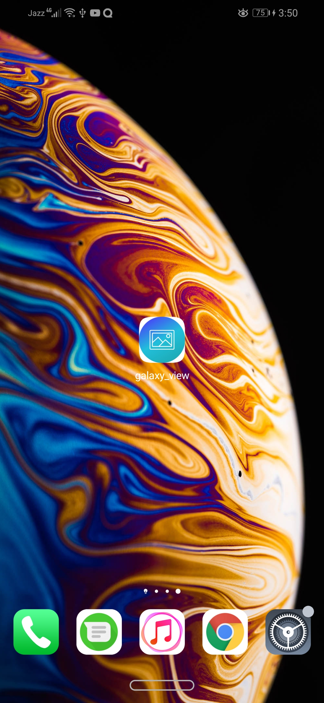
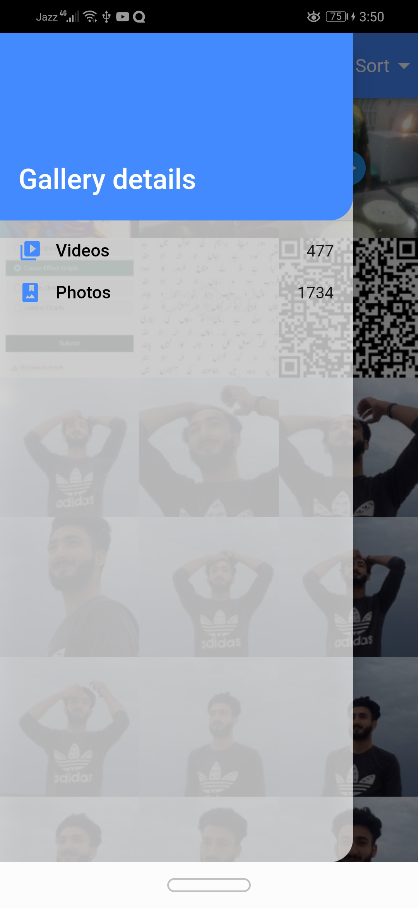
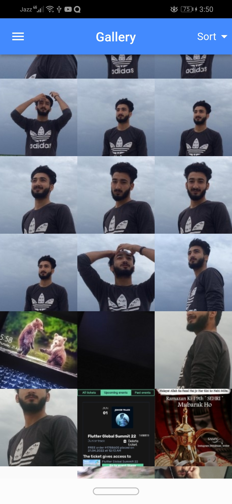
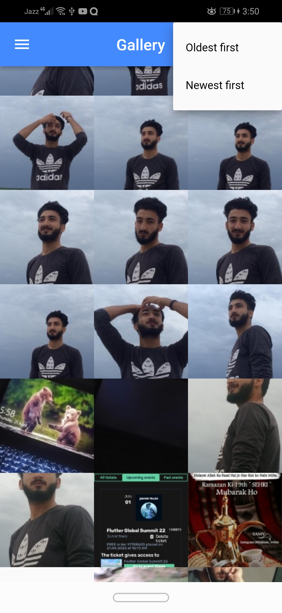

# galaxy_view

Galaxy App to view Galery photos and videos

## Getting Started

This project is a starting point for a Flutter application.

A few resources to get you started if this is your first Flutter project:

- [Lab: Write your first Flutter app](https://flutter.dev/docs/get-started/codelab)
- [Cookbook: Useful Flutter samples](https://flutter.dev/docs/cookbook)

For help getting started with Flutter, view our
[online documentation](https://flutter.dev/docs), which offers tutorials,
samples, guidance on mobile development, and a full API reference.
"# galaxy_view-Photo-View-App-" 

#### Flutter App Screenshots

<table>
  <tr>
    <th>Galaxy View</th>
     <td>Sort and Left menu Added</td>
  </tr>
  <tr>
    <td></td>
    <td></td>

  <tr>
     <td></td>
    <td></td>

  </tr>
 </table>
